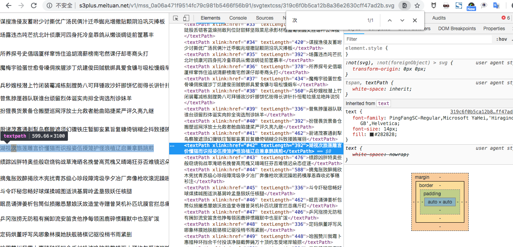
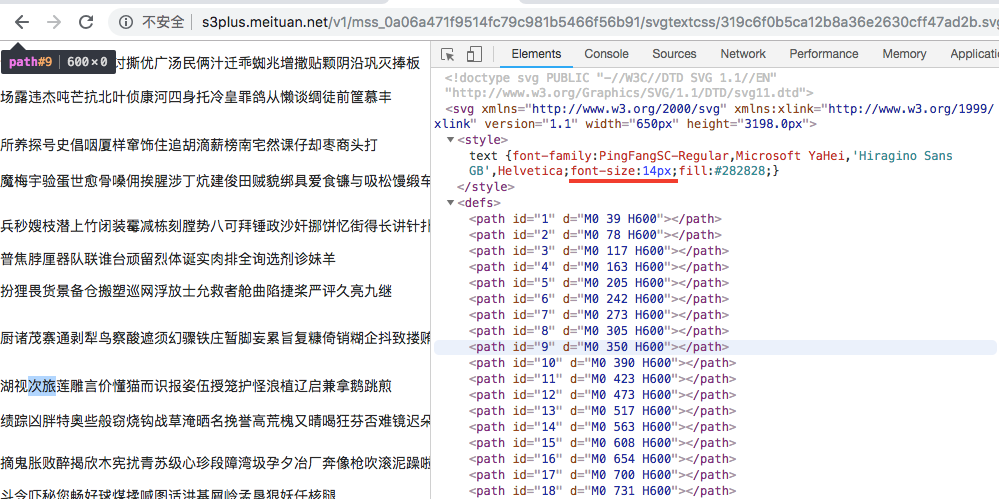
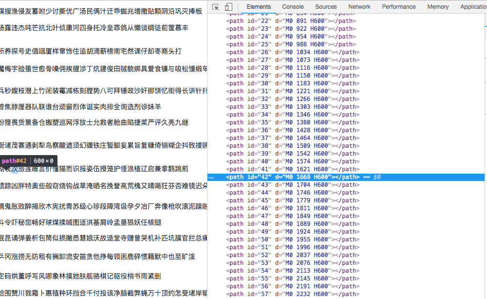
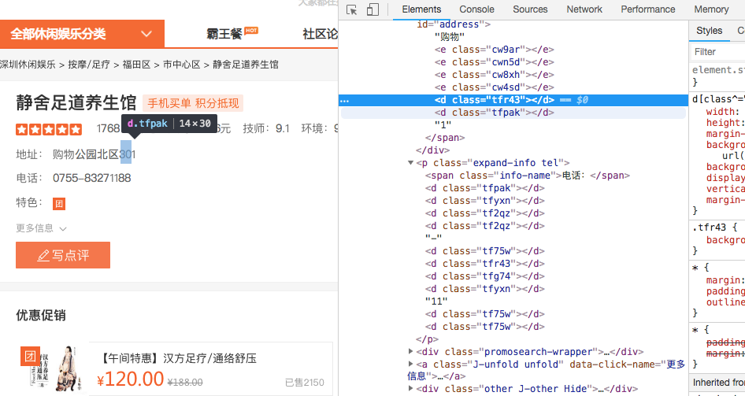
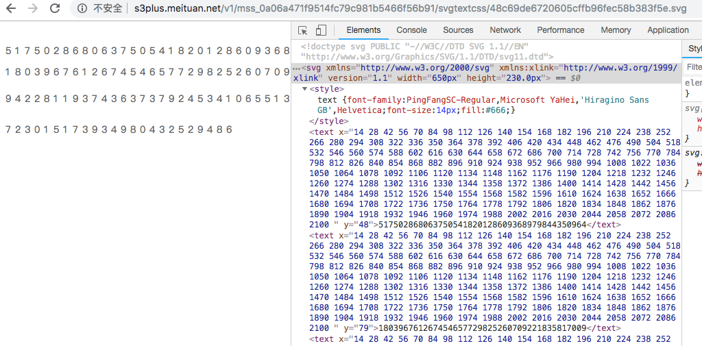
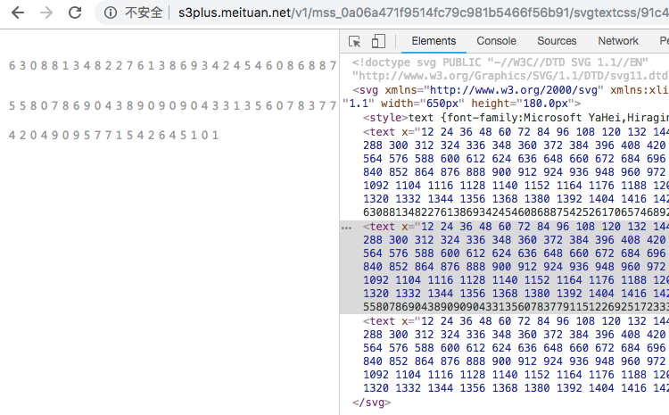

# 大众点评的最新反爬机制分析-2019-03-05

__“加密”与“解密”__：

DZDP将原文本的一些文字在服务器端进行“加密”，使其变成某种含有类属性的双端标记，如`b`（也有`e`，不同的位置不同），然后将处理后的文本发送至客户端浏览器。但由于DZDP需要在客户端的浏览器上展示原文本（总不能在网页上给用户看一堆`b`），因此服务器也同时把相应的“解密”规则（对应某些js代码）和“解密”所需文件（例如css文件）发送至客户端。浏览器虽然拿到的源代码是含有`b`标记的，但是连带传送过来的js代码会指导浏览器对`b`标记进行处理，使其变成“正常”的文字显示。

**实务分析**：

“解密”规则存放在某些js代码中，并不意味着我们需要去阅读js源码，因为Chrome的开发者工具会为我们贴心地展示出样式的加载关系，而忽略背后的js调用。

以下图中第一条评论里的“次”字为例。用Chrome的“检查”，发现“次”字在源代码中不是以文本的形式出现，而是一个没有内容的双端标记`<b></b>`，它有一个属性`class`（也就是“类”），属性值为`vqsms`。


同时需要注意到，右侧的Style栏提醒我们，类属性值为`vqsms`的标签被设置了css样式：
* 位置2：`vqsms`类被赋予了两个参数——`-476.0px`和`-631.0px`；
* 位置3：上述的对应关系定义在一个css文件中；
* 位置4：类的属性值以`vq`开头的`b`标签，他们的样式统统从`background-image`获取。

我们尝试打开`background-image`后的url，本例中是`s3plus.meituan.net/v1/mss_0a06a471f9514fc79c981b5466f56b91/svgtextcss/319c6f0b5ca12b8a36e2630cff47ad2b.svg`，如下：



到这里，我们可以大致得出解密原理：

1. 浏览器根据`b`标签的类的属性值，从某个css文件中，拿到两个参数（实质是偏移量，相当于x坐标与y坐标）；
2. 浏览器根据`b`标签的类的属性值的前两位，从同样的css文件中找到某个url，该url指向一个svg文件，该文件内部存放着大量文字；
3. 从该文件内容，根据此前拿到的参数，定位到目标文字，在显示上替换掉`b`标签；
4. 我们看到的是字，而不是`b`。

**从属性值到文字**

下面，我们来具体看看怎么从属性值`vqsms`拿到文字`次`。

首先，我们需要拿到该属性值对应的两个参数（坐标值）。该对应关系被储存在一个css文件中，该css文件为（对不同的店铺页面，该css文件可能不同）：

```
http://s3plus.meituan.net/v1/mss_0a06a471f9514fc79c981b5466f56b91/svgtextcss/5de9a9098d8d30d7d65f16ab93871bb4.css
```

因此，我们可以使用`requests`将其内容保存下来，储存在变量`cssData`中，以供后续查询使用：

```python
import requests

css_r = requests.get("http://s3plus.meituan.net/v1/mss_0a06a471f9514fc79c981b5466f56b91/svgtextcss/5de9a9098d8d30d7d65f16ab93871bb4.css")
cssData = css_r.text
```

我们从该css文件中观察到，样式定义的模式如下（注意，此处需自己打开该css查看，不要看Chrome的Style栏）：

```python
.vqsms{background:-28.0px -1646.0px;}
```

同时，我们还需要提供`vq`开头的文字样式的url，也在该css文件中：

```python
b[class^="vq"]{width: 14px;height: 30px;margin-top: -9px;background-image: url(//s3plus.meituan.net/v1/mss_0a06a471f9514fc79c981b5466f56b91/svgtextcss/319c6f0b5ca12b8a36e2630cff47ad2b.svg);background-repeat: no-repeat;display: inline-block;vertical-align: middle;}
```

因此，我们使用正则表达式查询：

```python
import requests
import re
#################
bClass = 'vqsms'
#################

css_r = requests.get("http://s3plus.meituan.net/v1/mss_0a06a471f9514fc79c981b5466f56b91/svgtextcss/5de9a9098d8d30d7d65f16ab93871bb4.css")
cssData = css_r.text

pattern1 = re.compile('\\.%s\\{background:(.*?)px (.*?)px;\\}' % bClass)
pattern2 = re.compile('\\[class\\^="%s"\\]\\{.*?background-image: url\\(//(.*?)\\);.*?\\}' % bClass[:2])
parameters = pattern1.search(cssData).groups()
parameters = [int(abs(eval(i))) for i in parameters]
svgUrl = pattern2.search(cssData).groups()[0]

# 我们将拿到
# ('-28.0', '-1646.0')
# s3plus.meituan.net/v1/mss_0a06a471f9514fc79c981b5466f56b91/svgtextcss/319c6f0b5ca12b8a36e2630cff47ad2b.svg
```

接着，我们打开该svg，看看怎么通过坐标值定位文字。我们定位到`次`，发现其在第42行，是第3个文字，也就是前面有2个文字：



42行，2个文字——这个和我们之前拿到的坐标`(28,1646)`有什么联系呢（这里我们将拿到的坐标值转化为正整数）？——我们从该svg的开头看到，一个文字的长度是`14`，而`28/14=2`，因此我们知道，一个文字位于某行的第几个，应该用“拿到的x坐标/14+1”，但因为索引从0开始，我们可以不用加上那个1。也就是说，如果我们把之前拿到的坐标设为`(x,y)`（去掉负号），则目标文字在某一行字符串中的index是`x/14`。


行的联系比较隐秘。我们看到，`次`在第42行，但y坐标是1646，貌似不是整倍数的关系。这时我们向上看，看到有许多`path`标签，其中`id=42`的标签，里面的文本中有`1669`，与1646很接近，两者相差23。因此，我们有理由猜测，行数是由y坐标先加上23，再对应到相应的`path`的`id`获得的。事实上的确如此，可以多试几个文字验证：



因此，我们的流程如下：
1. 首先将x坐标与y坐标全部化为正整数；
2. 将y坐标加上23，用正则寻找对应的`path`标签，拿到id，即行号；
3. 将x坐标除以14，得到目标文字的index；
4. 用行号配合正则抽取该行，再用index提取该文字；
5. 结束。

代码如下：

```python
import requests
import re
#################
bClass = 'vqsms'
#################

css_r = requests.get("http://s3plus.meituan.net/v1/mss_0a06a471f9514fc79c981b5466f56b91/svgtextcss/5de9a9098d8d30d7d65f16ab93871bb4.css")
cssData = css_r.text

pattern1 = re.compile('\\.%s\\{background:(.*?)px (.*?)px;\\}' % bClass)
pattern2 = re.compile('\\[class\\^="%s"\\]\\{.*?background-image: url\\(//(.*?)\\);.*?\\}' % bClass[:2])
parameters = pattern1.search(cssData).groups()
# 将坐标值转化为正整数
parameters = [int(abs(eval(i))) for i in parameters]
svgUrl = pattern2.search(cssData).groups()[0]

svg_r = requests.get("http://"+svgUrl)
svgData = svg_r.text

col = int(parameters[0]/14)
row = parameters[1]+23
pattern3 = re.compile('<path id="(\\d+)" d="[^/>]+%s[^/>]+"/>' % str(row))
realRow = pattern3.search(svgData).groups()[0]

pattern4 = re.compile('<textPath xlink:href="#%s" textLength="\\d+">(.*?)</textPath>' % realRow)
lineStr = pattern4.search(svgData).groups()[0]

targetWord = lineStr[col]

print(targetWord)
```

**还没结束：关于数字**



上图中的数字`3`被加密，对应的类属性值为`tfr43`。我们用上面的代码，发现报错。问题出在从svg文件中提取行数的过程。我们打开该svg，发现其格式与之前我们遇到的“文字类svg”不太一样：



该svg专职负责数字。

假设拿到xy坐标——`x`，`y`：

* 若y小于等于48，则在第1行；大于45小于等于79，则在第2行；大于79小于等于118，则在第3行；大于118，则在第4行；
* 确定行数后，用`(x+6)/14-1`得到目标数字的index。

**仍然没结束：关于灰色数字**

还有一类灰色数字，其svg的格式又不一样：假设拿到xy坐标——`x`，`y`：



* 若y小于等于45，则在第1行；大于45小于等于90，则在第2行；大于90，则在第3行；
* 确定行数后，用`(x+5)/12-1`得到目标数字的index。

**关于CSS文件**

保存x坐标与y坐标的css文件对于不同页面可能不同。需要首先访问原页面，再从页面中找到对应css文件的url，如下：

```
<link rel="stylesheet" href="//s3plus.meituan.net/v1/mss_0a06a471f9514fc79c981b5466f56b91/svgtextcss/a676937669f26544f365f62fc38dd4d0.css" type="text/css">
```

